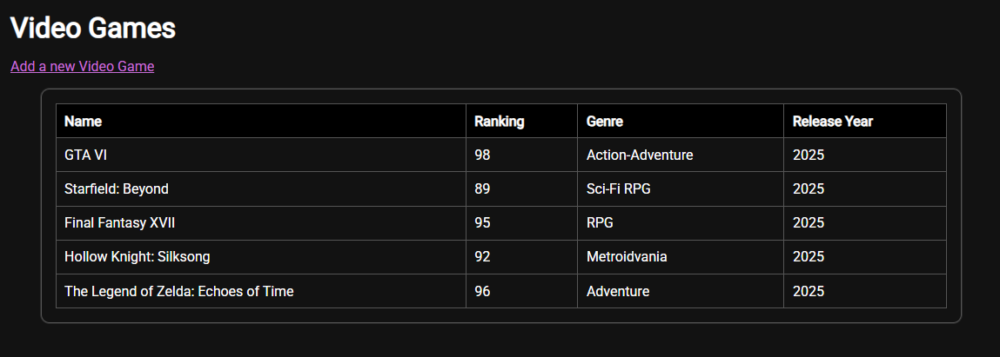

# Integrating With HubSpot I: Foundations Practicum – Video Games

Este repositorio contiene mi entrega para el **Integrating With HubSpot I: Foundations Practicum** de HubSpot Academy.  
El objetivo fue crear una aplicación Node.js que se conecte a la API de HubSpot para gestionar un **Custom Object**.

---

## 🎮 Custom Object: Video Games

- **Internal name del objeto:** `videogames`  
- **Propiedades creadas:**
  - `name` (string) – **obligatoria**
  - `ranking` (number)
  - `genre` (string)
  - `release_year` (number)

- **Número de registros creados:** 5  
- **Asociado con:** Contacts

👉 **Vista de lista del custom object en mi cuenta de prueba:**  
[VideoGames Object List View](https://app.hubspot.com/contacts/50449662/objects/2-49572380/views/all/list)

---

## 📂 Estructura del proyecto

jhon-asto-iwh-i-practicum/
├─ index.js
├─ package.json
├─ .gitignore
├─ /views
│ ├─ homepage.pug
│ ├─ updates.pug
│ └─ contacts.pug (ejemplo del repo base, no se usa)
├─ /public/css
│ └─ style.css
└─ README.md


---

## ▶️ Cómo ejecutar el proyecto

```sh
# 1) Clonar el repo
git clone https://github.com/<tu-usuario>/jhon-asto-iwh-i-practicum.git
cd jhon-asto-iwh-i-practicum

# 2) Instalar dependencias
npm install

# 3) Crear .env en la raíz (ejemplo)
# --- Pega esto en el archivo .env ---
PORT=3000
HUBSPOT_PRIVATE_APP_TOKEN=pat-xxxxxxxxxxxxxxxxxxxx
CUSTOM_OBJECT_ID=2-49572380
PROP_NAME=name
PROP_RANKING=ranking
PROP_GENRE=genre
PROP_RELEASE_YEAR=release_year
# ------------------------------------

# 4) Ejecutar
npm start
# abrir http://localhost:3000


## 🌐 Rutas de la app

GET  /             → muestra todos los registros del objeto VideoGames en tabla
GET  /update-cobj  → formulario para crear un nuevo videojuego
POST /update-cobj  → guarda el videojuego en HubSpot y redirige al home

## 📸 Vista previa



---